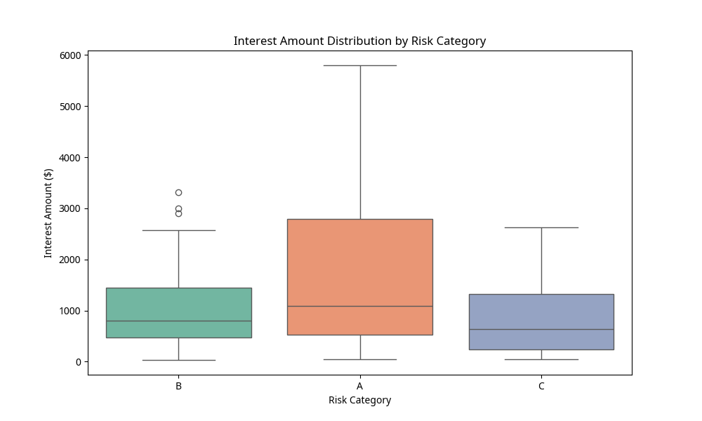
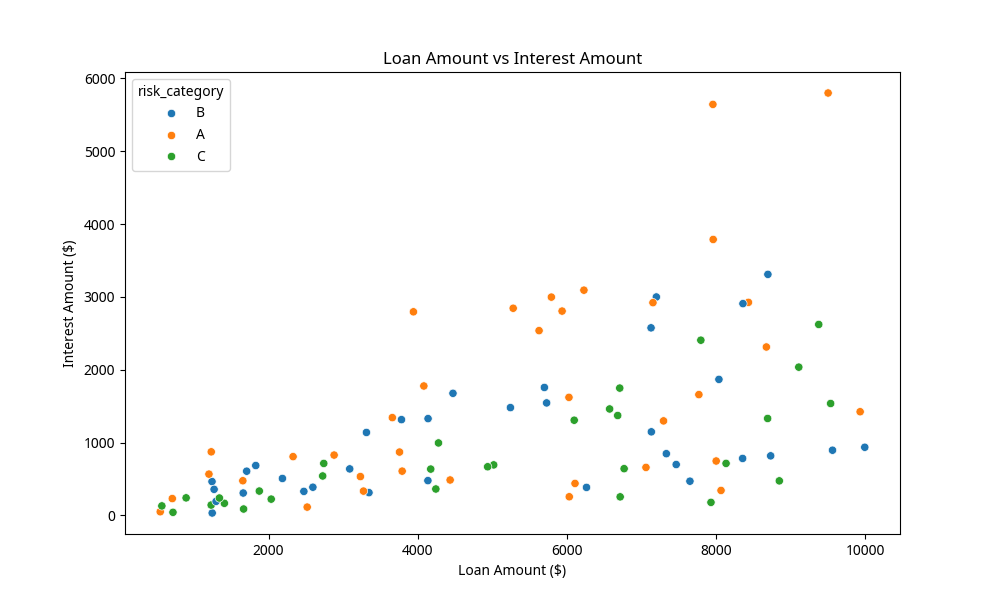

# Banking Legacy Modernization 🏦💻

## 🚀 Project Overview

This project demonstrates a robust approach to modernizing critical legacy systems in the banking sector. We refactor a 90s-era interest calculation system using **Golden Master Testing** to ensure zero regressions and the **Strategy Pattern** for a modular, future-proof architecture.

Beyond the engineering feat, this version includes a **Data Analytics Layer** to visualize the financial impact of the legacy rules and validate the consistency of the modernization process.

---

## 💡 The Problem: Legacy Systems in Banking

Old banking systems (often COBOL-based) are the backbone of financial operations but are:
- **Hard to Maintain**: Tangled business logic makes any change risky.
- **Rigid**: Adapting to new regulations or products is slow and costly.
- **Innovation Barriers**: Complexity prevents the adoption of modern cloud-native stacks.

---

## ✨ The Solution

### 1. Golden Master Testing
We capture the exact behavior of the legacy system by running 1,000+ test cases and saving the results as a "Golden Master". Any new implementation must match this output 100%.

### 2. Strategy Design Pattern
We decoupled the interest calculation logic into specific strategies (Risk A, B, C, VIP), making the system compliant with the **Open/Closed Principle**.

### 3. Data-Driven Validation (New!)
We use Python (Pandas/Seaborn) to analyze the generated data, ensuring that the modernization doesn't just match the output, but that the underlying financial distributions remain sound.

---

## 📊 Data Insights & Visualizations

### Interest Distribution by Risk
Validating how different risk categories are impacted by the calculation rules.

### Loan Amount vs Interest
Analyzing the correlation and identifying outliers in the legacy calculation logic.

---

## 🛠️ Tech Stack
- **Python 3.11+**
- **Pandas & Seaborn** (Data Analysis)
- **JSON** (Data Storage)
- **Git** (Version Control)

---

## 🚀 How to Run
1. **Generate Test Cases**: `python3 generate_test_cases.py`
2. **Create Golden Master**: `python3 golden_master_tester.py`
3. **Run Modernization Test**: `python3 run_modernization_test.py`
4. **Generate Data Insights**: `python3 scripts/data_analysis.py`

---

## 👤 Author
**Edinaldo Abreu**
🔗 [LinkedIn](https://www.linkedin.com/in/edinaldo-abreu) · [GitHub](https://github.com/NaldoAbreu)
